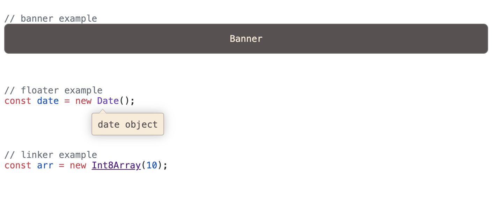

<div align="center">

<h1>//^</h1>

</div>

<div align="center">
<i>two and a half slashes</i>
</div>

A [Siki](https://siki.dev) extension for annotating code with
_**twoandhalfslash**_ comments.

## Usage

```shell
npm instsall twoandhalfslash
```

Add transformer to your Shiki config:

```javascript
import { codeToHtml } from "shiki";

const html = codeToHtml(code, {
    theme: "github-light",
    lang: "javascript",
    transformers: [
        twoandhalfslash(),
    ],
});
```

## Syntax

* Start a comment (prefix) with `//^` (two slashes, a caret, and a space).
* After the prefix, the command is annotated in square brackets `[]`.
* The arguments are separated by carets `^`.
* The first argument is the command name.

```
//^ [command^arg1^arg2^...]
```

All annotations require additional CSS to be applied.

#### Banner

Add a block element with the content will replace the comment. Add `ths-banner` class to the parent element.

```javascript
//^ [b^content]
```

#### Floating Label

Add a floating label to an element under the cursor (`^`). Add `ths-floater` class to the parent element.

```javascript
const date = new Date();
//^ [f^..........^content]
```

#### Linker

Convert text into a link. First argument is the text to be converted, second argument is the URL, and a third argument
is the link title.

```javascript
const arr = new Int8Array(10);
//^ [l^Int8Array^https://developer.mozilla.org^check out docs]
```

### Example

The results of the above examples with CSS applied:

