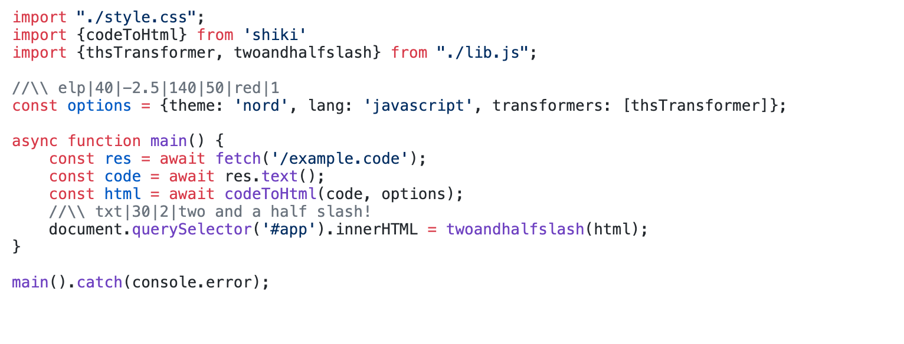

# Two And a Half Slashes

A [Siki](https://siki.dev) extension for annotating code with _**two and a half slashes**_ comments.

Without **_twoandhalfslash_**, the comments in the code:



With **_twoandhalfslash_**:


## Installation

```shell
npm install -D shiki twoandhalfslash
```

## Usage

```ts
import {codeToHtml} from "shiki";
import {twoandhalfslash} from "twoandhalfslash";

codeToHtml(code, {
    theme: "nord",
    extensions: [twoandhalfslash()]
});
```